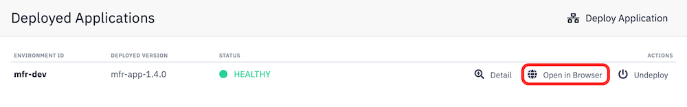

# Simple SpringBoot REST API


## What you'll learn

- How to setup a SpringBoot application.
- In this tutorial we will create simple REST API using SpringBoot scaffolder. 
- Later on we will add the security layer to it with Spring Security and Keycloak managed service.


## Project Source

This example project can be cloned from: git@gitlab.factory.codenow-dev.codenow.com:codenow-dev/api.git


## Prerequisities

- You are already familiar with CodeNow basics.
- You are familiar with concepts of REST web services.
- You have already created new application component with SpringBoot scaffolder. See [How To Create a New Application Component](https://www.codenow.com/docs/administration-manuals/create-new-component/) tutorial.
- You have already setup your local development environment for Java. See [TBD](https://www.codenow.com/docs/administration-manuals/) tutorial.


## Steps

1) Clone your application GIT repository and open the project in your IDE.

2) For the purposes of this tutorial we will not be using pre-generated "Hello World" service and its classes `HelloWorldResponse`, `HelloWorldController`. You can safely delete or ignore them.


**Model classes**

1) Add new model classes `Customer` and `Order`. They are very simple POJO classes with model attributes.

2) Generate getters, setters and constructor. For example:

```java
package org.example.service.model;

public class Customer {
    private int id;
    private String firstName;
    private String lastName;

    public Customer(int id, String firstName, String lastName) {
        this.id = id;
        this.firstName = firstName;
        this.lastName = lastName;
    }

    public int getId() {
        return id;
    }

    public void setId(int id) {
        this.id = id;
    }

// etc... 
```

3) Generate getters, setters and constructor.


**Simple business service**

1) Add a new service interface, for example:

```java
package org.example.service.business;

import org.example.service.model.Customer;
import java.util.List;

public interface CustomerService {
    
    public List<Customer> getAll();
    
    public Customer getById();
}

```

2) And its implementation emulating simple business service:

```java
package org.example.service.business.impl;

import org.example.service.business.CustomerService;
import org.example.service.model.Customer;
import org.springframework.stereotype.Service;

import javax.annotation.PostConstruct;
import java.util.ArrayList;
import java.util.List;

@Service
public class CustomerServiceImpl implements CustomerService {
    // this list serves only for testing purposes, real-world applications
    // will use appropriate resource managers instead
    private List<Customer> customers;

    // initialize test data
    @PostConstruct
    private void initializeList() {
        customers = new ArrayList<>();
        customers.add(new Customer(1, "John", "Petrucci"));
        customers.add(new Customer(2, "Zack", "Wylde"));
    }

    @Override
    public List<Customer> getAll() {
        return customers;
    }

    @Override
    public Customer getById(int id) {
        for (Customer c : customers) {
            if (c.getId() == id)
                return c;
        }

        return null;
    }
}
```

3) Please note, that we annotated service with Spring's `@Service` so it can be recognized as a service bean and will be instantiated by dependency injection. 


**REST controller**

1) Add a new class representing REST controller. For example:

```java
@RestController
@RequestMapping("/customers")
public class CustomerController {
    @Autowired
    CustomerService customerService;

    @GetMapping
    public List<Customer> getAll() {
        return customerService.getAll();
    }

    @GetMapping("/{id}")
    public ResponseEntity<Customer> getCustomer(@PathVariable int id) {
        Customer customer = customerService.getById(id);

        if (customer != null)
            return new ResponseEntity<>(customer, HttpStatus.ACCEPTED);
        else
            return new ResponseEntity<>(HttpStatus.NOT_FOUND);
    }
}
```

2) Please note we "auto-wired" service bean created in earlier steps.

3) That's enough of coding and now test our simple API.


**Testing in local environment**

1) If you need to change configuration parameters, for example TCP port, please do so in `config/application.yaml`.

2) Build and run our application. By default it runs on http://localhost:8080/customers

3) You can use any browser navigating to our service URL. You will receive JSON response.


**Testing in CodeNow environment**

1) After testing locally, commit changes to your repository and push it to CodeNow.

```
git add .
git commit -m "Initial commit"
git push
```

2) Follow standard deployment process in CodeNow, see [TBD](https://www.codenow.com/docs/administration-manuals/) for details.

3) Now you can click to "Open in browser" link under your application details. Swagger UI will open and you can test your service here.




